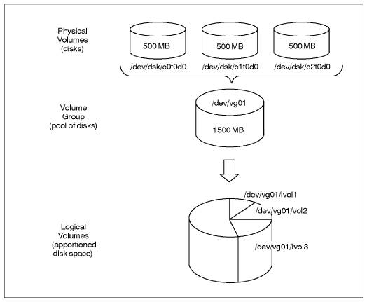
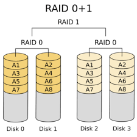
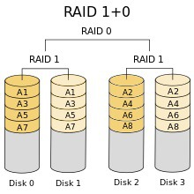

# 리눅스 LVM과 RAID의 개념

리눅스의 파티션에 대한 개념을 공부할때 생기는 의문점

LVM과 RAID의 역할

## Logical Volume Manager (LVM)

LVM은 논리적인 공간 관리자라는 뜻으로

여러개의 물리 디스크를 합쳐서 사용하는 기술이다.

작은용량의 하드디스크 여러 개를 큰 용량의 하드디스크 한 개처럼 사용할 수 있고

다수의 디스크를 묶어서 사용함으로써 파티션의 크기를 줄이거나 늘릴수도 있다.

합치는 것 뿐만 아니라 합친 불륨그룹을 다시 논리 볼륨으로 나눠서 사용할 수 있다.

## Redundant Array of Independent Disks (RAID)

RAID는 복수배열 독립 디스크 라는 뜻으로

여러개의 물리적 디스크를 하나의 논리적 디스크로 인식하여 작동하게 하는 기술이고 또

여러 디스크가 있을 때 같은 데이터를 다른 디스크에 중복 저장하는 방식으로도 사용된다.

데이터를 저장하는 다양한 방법이 존재하며 이를 레벨이라 하고

레벨에 따른 저장방식을 RAID N 이라고 칭한다. (N = 레벨)

### RAID 0

스트라이핑 저장 방식 연속된 데이터를 여러 디스크에 나눠 저장한다.

최소 2개의 하드디스크가 필요하다.

입출력 작업이 모든 디스크에서 동시에 진행된다.

저장과 읽기가 속도가 빠르지만 하나의 디스크라도 고장나면 전체 시스템이 사용불가 하다.

고장대비 능력이 없으므로 주요 데이터 저장은 부적합하다.

### RAID 1

미러링 방식 하나의 디스크에 데이터를 저장하면 다른 디스크에 동일한 내용이 백업되어 저장된다.

데이터 저장 시 두 배의 용량이 필요하다.

결함허용을 제공하지만 공간 효율성은 떨어진다.

동일한 데이터가 백업되기 때문에 주요한 데이터를 저장하기에 적합하다.

### RAID 3

스트라이핑 저장 방식

오류 검출을 위해 패리티 방식을 이용한다.

데이터 복구는 패리티 저장 디스크에 기록된 정보의 XOR 계산을 하여 수행한다.

대형 레코드가 사용되는 단일 사용자의 시스템에 적합하다.

### RAID 5

스트라이핑 저장 방식

디스크마다 패리티 정보를 갖고 있어 

패리티 디스크의 병목현상을 줄이는 것이 가능하여 실무에서 많이 사용한다.

쓰기 작업이 많지 않은 다중 사용자 시스템에 적합하다.

각 레벨의 장점을 합친 RAID구성으로는 대표적으로 RAID 0+1과 RAID 1+0이 있다.

### RAID 0+1

스트라이핑 방식과 미러링 방식의 조합이다.

디스크를 2개씩 RAID 0 으로 구성 후 RAID 0으로 구성된 하드디스크를 RAID 1로 구성한다.

속도는 빠르나 데이터 복수 시간이 오래 걸린다는 단점을 보유하고 있다.

### RAID 1+0

RAID 0+1 과 반대 구성으로 이루어져있다.

디스크를 2개씩 RAID 1 로 구성 후 RAID 1 로 구성된 하드디스크를 RAID 0 으로 구성한다.

미러링 한 후 스트라이핑을 진행하여 손실된 데이터만 빠른 복원이 가능하므로 RAID 0+1 보다

상대적으로 운영상 유리하다.

끝

